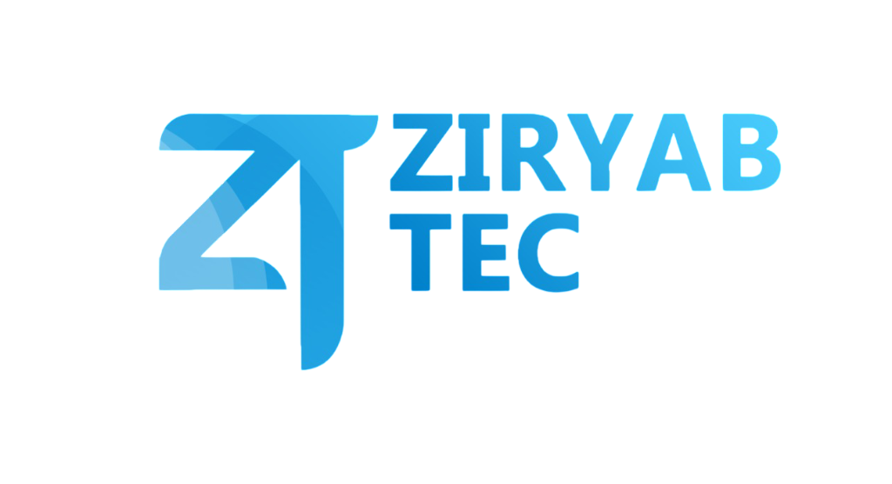

<div align="center">
  
  <h1>ZiryabTec</h1>
  <p><strong>Plateforme E-Learning Premium — Formations IT certifiantes</strong></p>

  
  
  
  
</div>

---

## À propos

**ZiryabTec** est une plateforme e-learning ultra-premium dédiée aux formations IT certifiantes en Intelligence Artificielle, Cloud Computing, Cybersécurité et développement logiciel. Conçue pour les talents marocains et francophones, elle offre une expérience d'apprentissage moderne avec tuteur IA contextuel, parcours adaptatifs et certificats vérifiables.

## Architecture des données

Le catalogue de formations suit une hiérarchie stricte à trois niveaux :

```
Thème (Theme)
  └── Catégorie (Category)
        └── Formation (Course)
```

| Thème | Catégories |
|-------|-----------|
| **Technologie** | Développement Web, Frontend, Backend, DevOps & CI/CD, Cloud Computing |
| **IA & Data** | Data Science, Machine Learning, Data Visualization |
| **Cybersécurité** | Cybersécurité |
| **Design** | UX Design |

Chaque formation possède des métadonnées de filtrage : `level`, `format`, `durationDays`, `featured`, liées à un `themeId` et un `categoryId`.

## Stack technique

| Couche | Technologie |
|--------|------------|
| Framework | Next.js 16.2 (App Router, Turbopack) |
| Langage | TypeScript 5 |
| Styling | Tailwind CSS 4, CSS custom properties |
| Animations | Framer Motion 12, Swiper.js |
| Icônes | Lucide React |
| Typographie | Plus Jakarta Sans, DM Sans, JetBrains Mono (Google Fonts) |
| Base de données | Prisma + SQLite (dev) |
| Design System | "Elite Clarity" — Light mode corporate |

## Structure du projet

```
├── app/                    # Pages (App Router)
│   ├── page.tsx            # Page d'accueil
│   ├── courses/            # Catalogue avec filtres
│   ├── portfolio/          # Portfolio + pages détail [slug]
│   ├── about/              # À propos
│   ├── not-found.tsx       # Page 404 personnalisée
│   └── layout.tsx          # Layout racine + WhatsApp FAB
├── components/
│   ├── landing/            # Sections de la landing page
│   ├── layout/             # Navbar, Footer
│   ├── portfolio/          # Composants portfolio
│   ├── courses/            # Composants détail cours
│   └── ui/                 # Design system (SectionWrapper, Badge, WhatsAppFAB...)
├── lib/
│   ├── data/               # Types, données mock, portfolio
│   └── i18n/               # Système bilingue FR/EN (dictionaries + context)
└── public/                 # Assets statiques
```

## Installation et lancement

```bash
# Cloner le dépôt
git clone https://github.com/achmaouiayoub120-beep/Ziryab-for-v4.git
cd Ziryab-for-v4

# Installer les dépendances
npm install

# Lancer le serveur de développement
npm run dev

# Build de production
npm run build
npm start
```

L'application sera accessible sur [http://localhost:3000](http://localhost:3000).

## Fonctionnalités clés

- **Sélecteur de langue bilingue** — Drapeaux SVG FR/EN côte à côte
- **Catalogue avec filtres** — Sidebar à checkboxes (Catégorie, Niveau, Format, Durée)
- **Portfolio professionnel** — Pages détail dynamiques avec SSG
- **Section Témoignages** — Carrousel Swiper.js avec autoplay
- **Page 404 personnalisée** — Design aligné sur la marque
- **Skeleton loaders** — Chargement fluide type SaaS
- **Accessibilité** — Navigation clavier, `focus-visible`, lazy loading

---

<div align="center">
  <sub>Fièrement conçu au Maroc 🇲🇦 — © 2026 ZiryabTec</sub>
</div>
